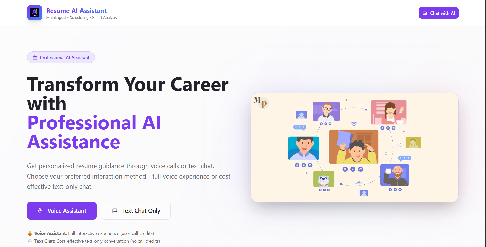
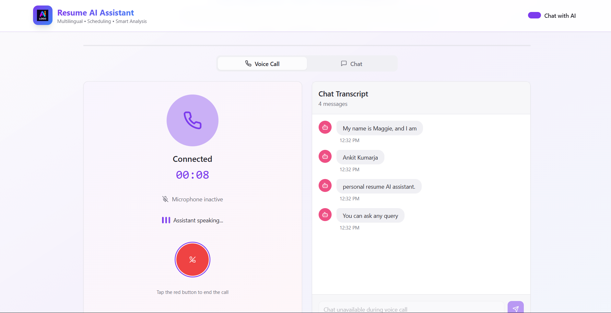
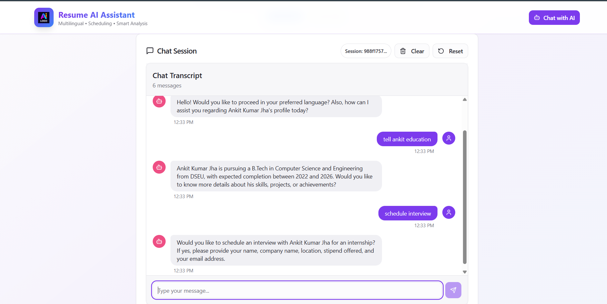
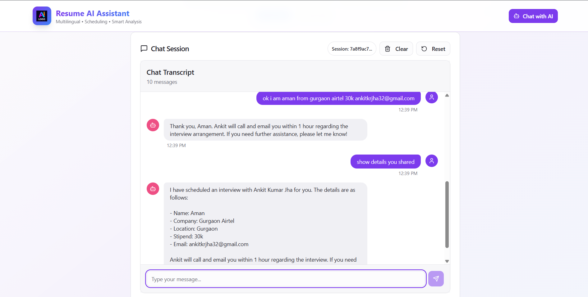

Welcome to **Readmefile**!  
# Personal AI Resume Assistant

  

## Overview

The Personal AI Resume Assistant is an intelligent automation platform designed to revolutionize professional workflow management and career development. This comprehensive solution leverages artificial intelligence to streamline meeting coordination, automate administrative tasks, and provide detailed professional insights through advanced reporting capabilities.

  

  

## Features

### 🤖 AI-Powered Meeting Coordination
- **Automated Call Scheduling**: Intelligent AI assistant makes calls to schedule meetings on your behalf
- **Smart Availability Management**: Automatically checks and manages your calendar availability
- **Professional Communication**: Maintains professional tone and etiquette during all interactions

### 📧 Email Automation
- **Confirmation Management**: Automatically sends and tracks meeting confirmations
- **Follow-up Sequences**: Manages post-meeting communications and follow-ups
- **Template Customization**: Personalized email templates for different scenarios

### 📊 Data Management & Integration
- **Google Sheets Integration**: Real-time updates to spreadsheets for meeting logs and professional data
- **n8n Workflow Automation**: Seamless workflow orchestration using n8n automation tools
- **Data Synchronization**: Ensures all platforms remain synchronized with latest information

### 📈 Professional Reporting
- **Comprehensive Reports**: Detailed summaries of education, projects, skills, and achievements
- **Interactive Queries**: Ask the assistant about specific aspects of your professional profile
- **Progress Tracking**: Monitor career development and goal achievement over time

### 🛠 Backend Infrastructure
- **Custom Tools**: Proprietary backend tools for enhanced functionality
- **Scalable Architecture**: Built to handle growing professional needs
- **Security First**: Implements robust security measures for data protection

## Technology Stack

- **AI/ML**: Advanced natural language processing for intelligent interactions
- **Automation**: n8n workflow automation platform
- **Integration**: Google Workspace APIs for seamless data management
- **Backend**: Custom-built tools and services for optimal performance

  

  <video src="readme_image/5.mp4" alt="Technology Stack & Workflow" width="700"/>

## Benefits

- **Time Efficiency**: Reduces manual scheduling and administrative tasks by up to 80%
- **Professional Image**: Maintains consistent professional communication
- **Data Insights**: Provides valuable insights into your professional growth
- **Workflow Optimization**: Streamlines complex professional processes

## Getting Started

1. Configure your AI assistant with personal preferences
2. Connect Google Sheets and email accounts
3. Set up n8n workflows for your specific needs
4. Begin automating your professional communications

## Support

For technical support and feature requests, please refer to the documentation or contact our support team.

---

*Empowering professionals through intelligent automation and AI-driven insights.*
